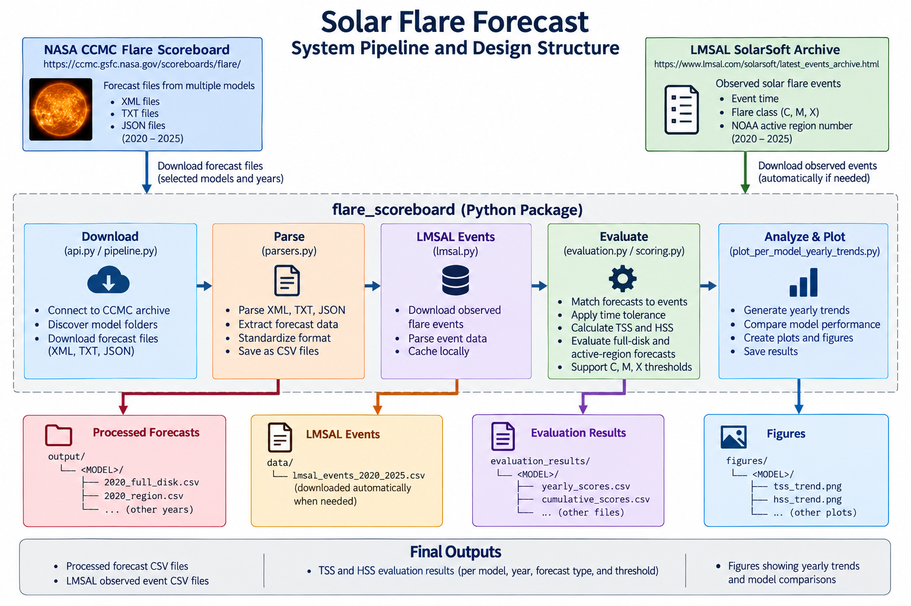

# Solar Flare Forecast

A Python package for downloading and evaluating historical solar flare forecasts from the NASA CCMC Flare Scoreboard.

The package retrieves forecasts from multiple forecasting models, obtains observed solar flare events from the LMSAL SolarSoft archive, and evaluates forecast performance using the True Skill Statistic (TSS) and Heidke Skill Score (HSS).

The project currently supports historical evaluation for 2020–2025.

## Features

- Download historical forecasts from the NASA CCMC Flare Scoreboard
- Parse XML, TXT, and JSON forecast files
- Evaluate full-disk and active-region forecasts
- Automatically download LMSAL observed flare events when needed
- Calculate True Skill Statistic (TSS) and Heidke Skill Score (HSS)
- Evaluate C-, M-, and X-class flare thresholds
- Generate yearly and cumulative evaluation results
- Save processed forecasts and evaluation results as CSV files
- Query full-disk and active-region forecasts through HAPI or local archive CSV files
- Automatically split HAPI downloads into requests of at most 31 days

## Installation

### Install from GitHub

Clone the repository and install the package:

```bash
git clone https://github.com/kkritika123/solar-flare-forecast.git
cd solar-flare-forecast
pip install .
```

Python 3.10 or later is required.

## Forecast Queries

Choose the model, forecast type, flare field, date range,
and source using `query_forecasts.py`.

### HAPI API

Download forecasts directly from HAPI:

```bash
python query_forecasts.py --source hapi --model NOAA_1 --type full_disk --flare M --start 2024-01-01 --end 2024-01-08
```

Long ranges are automatically split into requests of at most
31 days. CSVs are saved in `data/hapi/`.

### Processed Archive

Select forecasts from existing processed archive CSVs:

```bash
python query_forecasts.py --source archive --model NOAA_1 --type full_disk --flare M --start 2024-01-01 --end 2024-01-08 --archive-dir output
```

This reads files under `output/<MODEL>/` and saves selected
results in `data/archive/`. It does not download missing files.

Use `download_forecasts()` to download and process archive
files first, as shown in Quick Start.

### Batch Queries

Selected models, full-disk M only:

```bash
python query_forecasts.py --source archive --all --models NOAA_1 ASSA_1 --type full_disk --flare M --start 2024-01-01 --end 2024-01-08
```

All 10 default models, both types, all available fields:

```bash
python query_forecasts.py --source archive --all --start 2024-01-01 --end 2024-01-08
```

Use `--source hapi` for API batch queries.

| Option | Meaning |
|---|---|
| `--model` | One model |
| `--all` | Enable batch queries |
| `--models` | Selected models in batch mode; otherwise use the default 10 |
| `--type` | `full_disk` or `active_region`; batch mode queries both when omitted |
| `--flare` | Exact field or threshold name; batch mode queries all available fields when omitted |
| `--start`, `--end` | UTC forecast-window start range: start inclusive, end exclusive |
| `--source` | `hapi` or `archive`; default is `hapi` |
| `--archive-dir` | Processed archive folder; default is `output` |
| `--out` | Output filename for a single query |

A single-model query requires `--model` and `--flare`.
Its default type is `full_disk`.

Repeating a query replaces its data CSV. Each run saves a
separate timestamped report.

## API and Archive Comparison

Compare the same query against HAPI and processed archive data:

```bash
python test_compare.py --model NOAA_1 --type active_region --flare M --start 2024-01-01 --end 2024-01-08 --archive-dir output --out noaa_ar_m_week.csv
```

Records are matched by window start, window end, issue time,
and region ID for active-region forecasts.

The report counts shared records, source-only records, matching
probabilities, differences, and invalid probabilities.
Comparison CSVs are saved in `data/comparison/`.

### Tested NOAA Sample

For January 1–7, 2024:

| M forecast type | HAPI records | Archive records | Matches | Differences |
|---|---:|---:|---:|---:|
| Full-disk | 21 | 21 | 21 | 0 |
| Active-region | 36 | 36 | 36 | 0 |

Neither sample contained source-only records.
These results do not establish agreement for all models or years.

### Limitations

- HAPI fields and archive thresholds use exact names.
  `M`, `MPlus`, and `M1+` require semantic verification before comparison.
- Archive files from the previous year may be needed for forecasts
  issued before the requested window range.
- Invalid archive window-start dates are excluded with a warning.
  Invalid issue/end dates in selected records cause an error.
- Available fields and date coverage vary by source and model.
- SPS HAPI metadata returned HTTP 500 during testing.
- `evaluate()` currently reads processed archive data;
  HAPI query exports are not yet connected to evaluation.


## Quick Start: Archive Download and Evaluation

Download archive forecasts and evaluate them against LMSAL observations:

```python
from flare_scoreboard import download_forecasts, evaluate

download_forecasts(
    models=["NOAA_1"],
    years=[2024],
)

results = evaluate(
    models=["NOAA_1"],
    years=[2024],
)

print(results)
```

If the required LMSAL observations are missing, `evaluate()`
downloads them automatically.

Processed forecasts are saved in `output/<MODEL>/`.
Evaluation results are saved in `evaluation_results/<MODEL>/`.

This example uses the archive workflow.

## Download LMSAL Events Directly

Observed solar flare events can also be downloaded separately from the LMSAL SolarSoft archive:

```python
from flare_scoreboard import download_lmsal_events

events = download_lmsal_events(
    start="2024-01-01",
    end="2024-12-31",
    out="data/lmsal_events_2024.csv"
)

print(events.head())
```

This step is optional because `evaluate()` automatically downloads the required LMSAL event data when it is not already available.

## Repository Structure

| File or folder | Purpose |
|---|---|
| `flare_scoreboard/` | Installable Python package |
| `flare_scoreboard/api.py` | Public download, query, comparison, and evaluation functions |
| `flare_scoreboard/hapi.py` | HAPI requests and 31-day download chunks |
| `flare_scoreboard/crawl.py` | Archive model discovery |
| `flare_scoreboard/parsers.py` | XML, TXT, and JSON forecast parsers |
| `flare_scoreboard/pipeline.py` | Archive download and processing pipeline |
| `flare_scoreboard/lmsal.py` | Observed flare-event retrieval |
| `flare_scoreboard/evaluation.py` | Event matching and TSS/HSS calculations |
| `flare_scoreboard/scoring.py` | Evaluation result generation |
| `query_forecasts.py` | Command-line HAPI and processed archive queries |
| `test_compare.py` | Command-line API-versus-archive comparison |
| `main.py`, `model.py` | Original archive and evaluation scripts |
| `scrape_lmsal_events.py` | Standalone observation-download script |
| `plot_per_model_yearly_trends.py` | Research plotting utility |
| `config.json` | Workflow configuration |
| `pyproject.toml`, `requirements.txt` | Package metadata and dependencies |
| `README.md` | Installation and usage documentation |

The `flare_scoreboard` directory contains the installable Python package.
The root-level scripts are retained for the original research workflow and plotting utilities.

## Archive Download and Evaluation Pipeline

The diagram below shows how forecast data and observed flare events move through the system.



`download_forecasts()` retrieves and parses forecast files from the CCMC archive. `evaluate()` matches the forecasts against observed LMSAL flare events and calculates TSS and HSS scores. If the required LMSAL event data is missing, it is downloaded automatically.

## Running the System

### Download Forecasts

Choose the models and years you want to process:

```python
from flare_scoreboard import download_forecasts

download_forecasts(
    models=["NOAA_1", "SIDC_v2"],
    years=[2024]
)
```

Parsed forecast files are saved in:

```text
output/<MODEL>/
```

### Evaluate Forecasts

After downloading the forecasts, run:

```python
from flare_scoreboard import evaluate

results = evaluate(
    models=["NOAA_1", "SIDC_v2"],
    years=[2024]
)

print(results)
```

Evaluation results are saved in:

```text
evaluation_results/<MODEL>/
```

The returned pandas DataFrame also contains the calculated TSS and HSS scores for further analysis.

### Plot Yearly Trends

The repository also includes a plotting script for generating TSS/HSS trend figures:

```bash
python plot_per_model_yearly_trends.py
```

To generate a combined grid:

```bash
python plot_per_model_yearly_trends.py --combined-grid --no-per-model --poster --dpi 300 --grid-ncols 3
```

## Evaluation

Forecasts are evaluated against observed solar flare events from the LMSAL SolarSoft archive.

The evaluation supports both:

- **Full-disk forecasts** — predictions for solar flare activity across the entire visible solar disk.
- **Active-region forecasts** — predictions associated with individual NOAA active regions.

Forecast performance is measured using the **True Skill Statistic (TSS)** and **Heidke Skill Score (HSS)**.

### True Skill Statistic (TSS)

TSS measures how well a forecasting system separates events from non-events:

```text
TSS = TP / (TP + FN) - FP / (FP + TN)
```

### Heidke Skill Score (HSS)

HSS measures forecast skill relative to random chance:

```text
HSS = 2(TP × TN - FN × FP) /
      ((TP + FN)(FN + TN) + (TP + FP)(FP + TN))
```

where:

- `TP` = True Positives
- `TN` = True Negatives
- `FP` = False Positives
- `FN` = False Negatives

The evaluation can calculate scores for C-, M-, and X-class flare thresholds depending on the forecast data available for each model.

## Models Evaluated

Ten CCMC models are currently included:

```
NOAA_1, SIDC_v2, ASSA_1, ASSA_24H_1, AMOS_v1,
ASAP_1, A-Effort, DAFFS, MagPy, SPS_1
```

## Data Sources

| Source | Description |
|---|---|
| [NASA CCMC Flare Scoreboard](https://ccmc.gsfc.nasa.gov/scoreboards/flare/) | Daily flare forecasts from multiple research groups (XML / JSON / TXT) |
| [LMSAL SolarSoft Latest Events](https://www.lmsal.com/solarsoft/latest_events_archive.html) | GOES flare event catalog used as ground truth |
